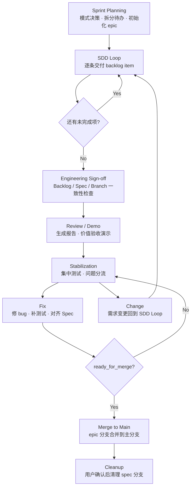
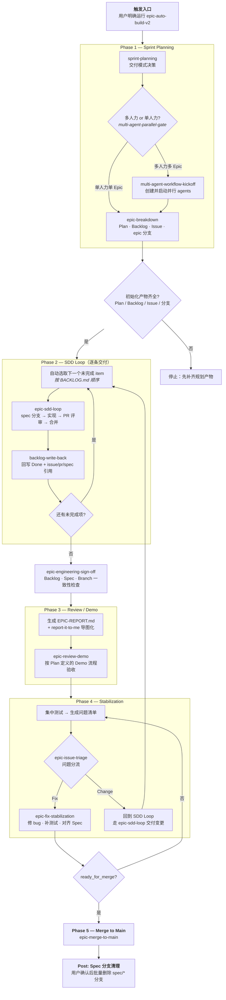

# auto-build-loop

```text
                  .-========================-.
              .-==                            ==-.
           .-==      __                __        ==-.
         .==        /  \____    ____/  \          ==.
        ==         /  /\___ \__/ ___/\  \          ==
       ==         /__/    \  ____  /  \__\          ==
       ==         \  \__  / /    \ \  /  /          ==
        ==         \____\/_/  /\  \_\/__/          ==
         .==                 /  \                 ==.
           .-==             / /\ \             ==-.
              .-==         /_/  \_\         ==-.
                  '-========================-'

                     auto-build-loop
```

一套用于 **自动化开发 Epic 级需求** 的 AI Skill Pack。
核心流程：**Sprint Planning → SDD Loop → Review / Demo → Stabilization → Merge**。

---

## Table of Contents

- [Workflow Overview](#workflow-overview)
- [Quick Start](#quick-start)
- [Prerequisites](#prerequisites)
- [Flow Canvas（详细流程图）](#flow-canvas)
- [Included Skills](#included-skills)

---

## Workflow Overview



---

## Quick Start

1. **准备设计文档** — 使用强模型（如 ChatGPT-Pro、Claude Opus）产出技术设计文档，保存至项目内（如 `docs/blueprint.md`）。
2. **触发流程** — 在 AI Agent 中运行：

```text
@epic-auto-build-v2 docs/blueprint.md
```

流程将自动完成：规划 → 逐条开发 → 评审演示 → 稳定化 → 合并。

---

## Prerequisites

> 在运行本 Skill Pack 前，请逐项确认以下准备工作。

### 1. 基础工具

| 工具 | 用途 | 必需? |
|------|------|-------|
| `git` | 版本控制 | 是 |
| `gh` (GitHub CLI) | 创建/管理 Issue、PR | 是 |
| `node` / `python` | 项目依赖的语言运行时 | 视项目而定 |

- 完成 `gh auth login`，确保当前仓库可创建/查看 Issue 与 PR。
- 若使用 Claude Teams，确保已登录对应团队工作区并具备项目访问权限。

### 2. 安装并初始化 OpenSpec

- 安装 OpenSpec CLI（按你团队的标准安装方式）。
- 在仓库根目录初始化（只需一次）：
  - 方式 A：使用 `openspec-init` skill 执行初始化。
  - 方式 B：直接运行 OpenSpec CLI init，确认 `OpenSpec/` 目录已生成。
- 建议先跑一次校验命令（如 `openspec validate`）确认环境可用。

### 3. 链接 Skill Pack 到本地

将本仓库技能同步到本地环境：

```bash
bash codex/skills/sync-codex-skills-to-cloud/scripts/link_repo_skills_to_codex.sh
```

验证关键技能可见：`epic-auto-build-v2`、`epic-sdd-loop`、`openspec-init-change`、`git-pr-review`。

### 4. 初始化项目上下文

在目标仓库中准备 `AGENTS.md`（项目约束、分支策略、测试命令、文档路径约定）：

- **Codex 路径（推荐）**：执行 `openspec-init` 并按提示把 bootstrap 规则写入 `AGENTS.md`。
- **Claude 路径（可选）**：在 Claude Code 中补齐等价约束文档（`AGENTS.md` / `CLAUDE.md`），确保分支策略与本流程一致：`main → epic/* → spec/*`。

### 5. 启动前检查清单

- [ ] 已有明确设计文档（Blueprint / PRD / Tech Plan）
- [ ] 已确定 `<epic-name>` 及 `epic/<epic-name>` 分支名
- [ ] 仓库根目录将使用唯一 `BACKLOG.md` 作为执行源
- [ ] 团队已同意 Review Gate：远端 review + High/Medium 闭环 + CI 全绿后合并
- [ ] AI Agent 具备足够权限：读取/修改文件、创建分支、执行 `git` / `gh` / `openspec` 命令

---

## Flow Canvas

> 用一张图完整说明 `epic-auto-build-v2` 的执行阶段、门禁、回路与调用的核心 Skill。



### Reading Guide

| 阶段 | 要点 | 门禁条件 |
|------|------|----------|
| **Phase 1 Sprint Planning** | 通过 `multi-agent-parallel-gate` 做模式决策（单人 / 多人），再由 `epic-breakdown` 产出 Plan、Backlog、Issue 和 epic 分支 | 所有初始化产物齐全才进入 Phase 2 |
| **Phase 2 SDD Loop** | 强制单条交付：自动选取第一个未完成 item → `epic-sdd-loop` → `backlog-write-back`；分支走 `spec/* → epic/*` | 每条 item 的 PR 通过 review + CI 全绿后合并 |
| **Engineering Sign-off** | `epic-engineering-sign-off` 做 Backlog / Spec / Branch 三项一致性检查 | 全部通过才进入 Phase 3 |
| **Phase 3 Review / Demo** | 生成汇总报告（Markdown + `.xmind`），再由 `epic-review-demo` 执行价值验收演示 | 产物提交到 epic 分支 |
| **Phase 4 Stabilization** | `epic-issue-triage` 分流：**Fix**（修 bug、对齐 Spec）→ `epic-fix-stabilization`；**Change**（需求变更）→ 回 SDD Loop | `ready_for_merge = true` 才进入 Phase 5 |
| **Phase 5 Merge** | `epic-merge-to-main` 将 epic 分支合并回 main | — |
| **Post: Cleanup** | 汇总 `spec/*` 分支列表，**需用户确认**后才批量删除 | 默认保留，不自动删除 |

---

## Included Skills

### Workflow Entry Points（流程入口）

| Skill | 说明 |
|-------|------|
| `epic-auto-build-v2` | 全流程编排器（5 阶段一键执行） |
| `epic-stabilization` | 单独触发稳定化阶段（Phase 4） |
| `references/epic-workflow.md` | 工作流关系模型与强约束定义 |

### Dependent Skills（依赖技能）

| Skill | 阶段 | 说明 |
|-------|------|------|
| `sprint-planning` | Phase 1 | 交付模式决策（单人 / 多人） |
| `multi-agent-parallel-gate` | Phase 1 | 并行效率评估门禁 |
| `multi-agent-workflow-kickoff` | Phase 1 | 多 agent 并行启动 |
| `epic-breakdown` | Phase 1 | Plan → Backlog → Issue → 分支初始化 |
| `blueprint-compiler` | Phase 1 | 设计文档编译为实施计划 |
| `backlog-generate` | Phase 1 | 从设计文档生成 Backlog |
| `backlog-issue-sync` | Phase 1 | Backlog ↔ GitHub Issue 同步 |
| `epic-sdd-loop` | Phase 2 | 单条 backlog item 交付循环 |
| `openspec-init-change` | Phase 2 | 初始化 OpenSpec 变更 + Issue |
| `backlog-write-back` | Phase 2 | 完成后回写状态到 BACKLOG.md |
| `git-pr-review` | Phase 2 | PR 创建 + 评审闭环 |
| `git-resolve-pr-comments` | Phase 2 | 处理 PR 评审评论 |
| `git-merge-recent-pr` | Phase 2 | 合并最近 PR 并同步分支 |
| `git-create-pr` | Phase 2 | 创建 PR |
| `epic-engineering-sign-off` | Phase 2→3 | Backlog / Spec / Branch 一致性检查 |
| `epic-review-demo` | Phase 3 | 核心场景演示与验收 |
| `report-it-to-me` | Phase 3 | Markdown 报告转 XMind 导图 |
| `xmind` | Phase 3 | XMind 文件操作 |
| `epic-issue-triage` | Phase 4 | 问题分流（Fix / Change） |
| `epic-fix-stabilization` | Phase 4 | 集中修复（仅 bug + 补测试） |
| `epic-merge-to-main` | Phase 5 | Epic 分支合并回 main |
| `check-env` | 通用 | 检查环境变量配置 |
