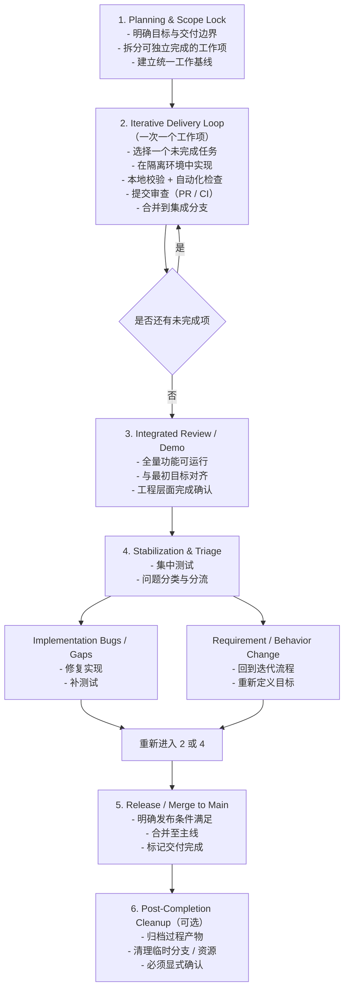
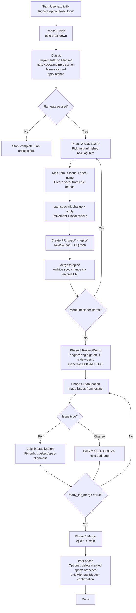

# auto-build-loop

```text
                  .-========================-.
              .-==                            ==-.
           .-==      __                __        ==-.
         .==        /  \____    ____/  \          ==.
        ==         /  /\___ \__/ ___/\  \          ==
       ==         /__/    \  ____  /  \__\          ==
       ==         \  \__  / /    \ \  /  /          ==
        ==         \____\/_/  /\  \_\/__/          ==
         .==                 /  \                 ==.
           .-==             / /\ \             ==-.
              .-==         /_/  \_\         ==-.
                  '-========================-'

                     auto-build-loop
```

## Quick Start

先完成以下 2 步，再触发自动化流程：

1. 使用 GPT PRO 产出整体设计思路，并将文档保存到项目内（例如 `docs/blueprint.md`）。
2. 在 CLI 中使用 `@auto-build-v2` 并附上文档路径。

```bash
@auto-build-v2 docs/blueprint.md
```

这个目录用于分发 Epic 自动化开发流程（Plan -> SDD Loop -> Review/Demo -> Stabilization -> Merge）。

## Prerequisites

在运行本 Skill Pack 前，请先完成以下准备工作。

### 1) 基础环境

- 安装 `git`、`gh`（GitHub CLI）、`node`（若你的项目依赖前端工具链）、`python`（若你的项目依赖 Python 工具链）。
- 完成 `gh auth login`，确保当前仓库可创建/查看 Issue 与 PR。

### 2) 安装并初始化 OpenSpec

- 安装 OpenSpec CLI（按你团队的标准安装方式）。
- 在仓库根目录初始化 OpenSpec（只需一次）：
  - 若你已安装本仓库 skill：使用 `openspec-init` skill 执行初始化。
  - 或直接使用 OpenSpec CLI 完成 init，并确认 `OpenSpec/` 目录已生成。
- 初始化后建议先跑一次校验命令（例如 validate/lint）确认环境可用。

### 3) 初始化 Codex 技能环境（推荐）

- 将本仓库技能链接到本地 `~/.codex/skills`：
  - `bash codex/skills/sync-codex-skills-to-cloud/scripts/link_repo_skills_to_codex.sh`
- 验证关键技能可见：`epic-auto-build-v2`、`epic-sdd-loop`、`openspec-init-change`、`git-pr-review`。

### 4) 使用 Codex 或 Claude 初始化项目上下文

- Codex 路径（推荐）：
  - 在仓库根目录准备 `AGENTS.md`（项目约束、分支策略、测试命令、文档路径约定）。
  - 如需 OpenSpec 引导内容，可执行 `openspec-init` 并按提示把 bootstrap 规则写入 `AGENTS.md`。
- Claude 路径（可选）：
  - 在 Claude Code 中打开同一仓库，补齐等价的项目约束文档（例如 `AGENTS.md`/`CLAUDE.md`）。
  - 确保与本 README 的流程约束一致：`main -> epic/* -> spec/*`，以及 `spec/* -> epic/*` 的 PR 方向。

### 5) 启动 Epic 流程前检查清单

- 已有明确设计文档（Blueprint/PRD/Tech Plan）。
- 已确定 `<epic-name>`，并约定 `epic/<epic-name>` 分支名。
- 仓库根目录将使用唯一 `BACKLOG.md` 作为执行源。
- 团队已同意 Review Gate：等待远端 review + 处理 High/Medium + CI 全绿后合并。
- 已为 AI Agent 提供足够权限（permission）：至少允许读取/修改仓库文件、创建分支、执行 `git`/`gh`/`openspec` 命令；若权限不足，`epic-auto-build-v2` 会在中途阻塞。

## Included workflow entry points
- epic-auto-build-v2
- epic-stabilization
- codex/skills/epic-auto-build-v2/references/epic-workflow.md

## Included dependent skills
- epic-breakdown
- epic-sdd-loop
- epic-engineering-sign-off
- epic-review-demo
- epic-issue-triage
- epic-fix-stabilization
- epic-merge-to-main
- blueprint-compiler
- backlog-generate
- backlog-issue-sync
- backlog-write-back
- openspec-init-change
- git-pr-review
- git-merge-recent-pr
- git-create-pr
- git-resolve-pr-comments
- check-env
- report-it-to-me
- xmind

## Simple workflow overview



## Flow canvas

> 目标：用一张图快速说明 `epic-auto-build-v2` 的执行阶段、强约束与回路。



### Reading Guide

- `Phase 1` 是硬门禁：没有 `Plan + Backlog + Issues + epic branch`，后续全部不允许开始。
- `Phase 2` 是单条循环：一次只做一个 backlog item，且必须走 `spec/* -> epic/*`，不能直连 `main`。
- `PR Gate` 是必经点：必须等远端 review 出现并闭环 High/Medium，且 CI 全绿后才可合并。
- `Phase 4` 是收敛分流：Fix 留在稳定化链路，Change 回流到 `SDD LOOP` 重新走 Spec 驱动交付。
- 只有 `ready_for_merge: true` 才能进入 `epic/* -> main`。
- `spec/*` 分支默认保留，只有在 Epic 完成后且用户明确确认才批量清理。
